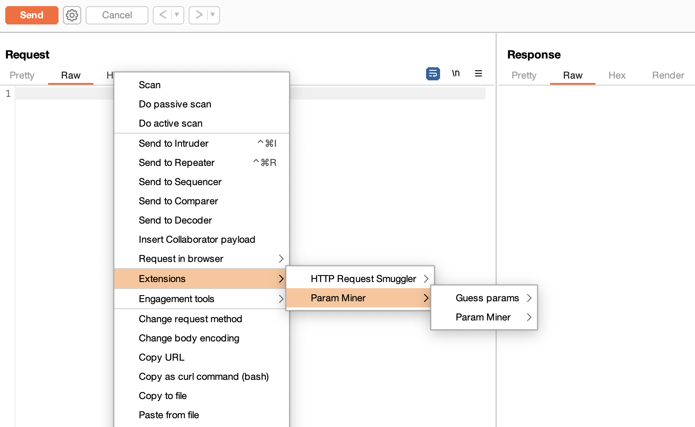
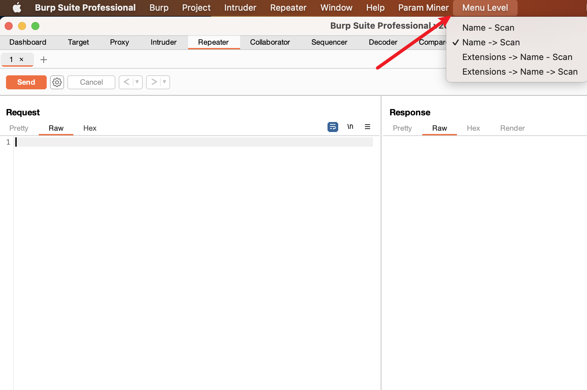
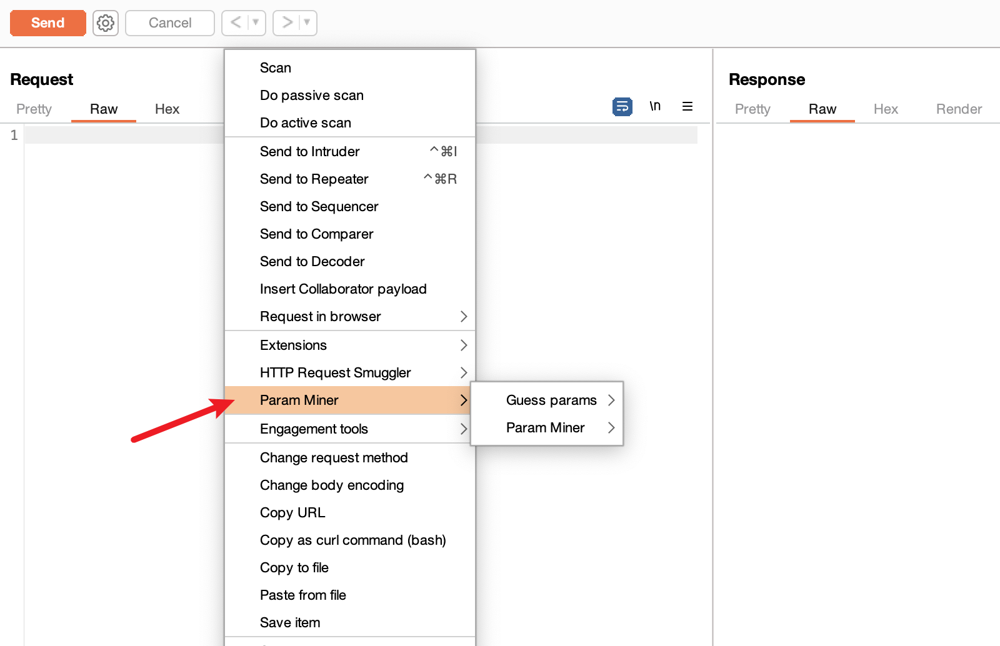

BurpSuite新版本中，插件注册的右键菜单是在第三层，即Extensions -> 插件名 -> 插件菜单，这样点起来有些麻烦。所以写了个小插件，用于修改菜单层级，可以将插件菜单放在第一或第二层。

如何实现的：《[Burpsuite 插件开发 - 修改右键菜单层级](https://ovi3.github.io/2023/09/27/burpsuite-extension-menu-level/)》

A simple BurpSuite extension to change extension context menu level, using in BurpSuite v2021.7 version and newer.  

## 截图

默认：

设置：

效果：

